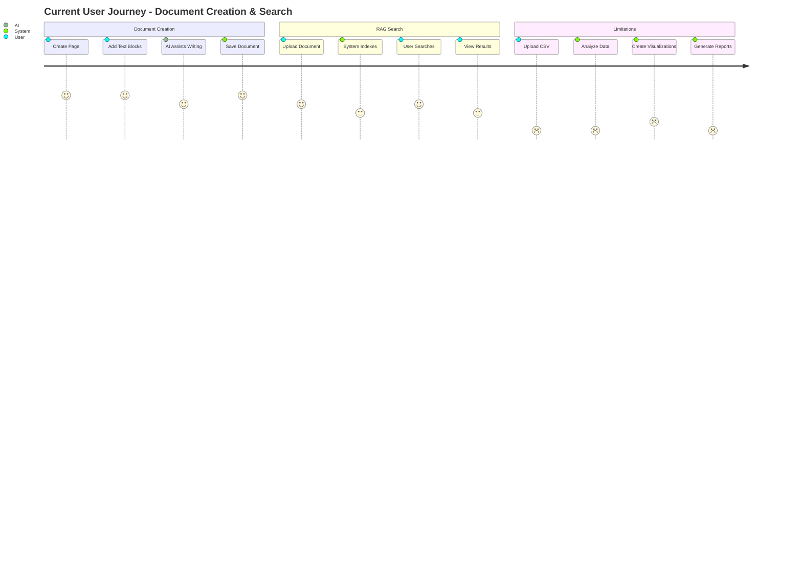
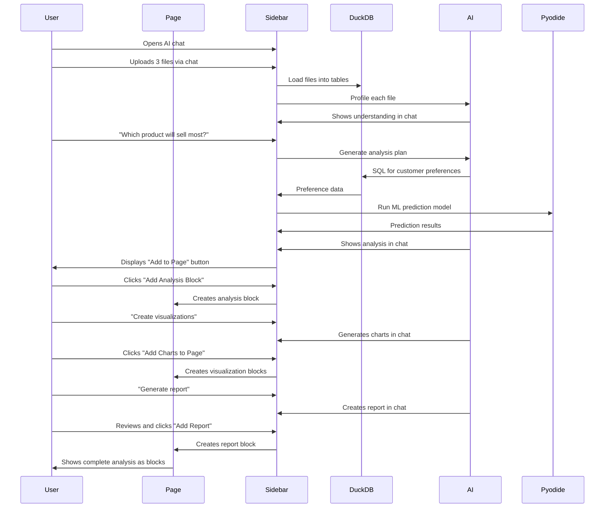

# Platform Pivot Development Document
## From RAG Application to Data Analytics & Research Suite

---

# Executive Summary

This document outlines the strategic pivot of our current Retrieval-Augmented Generation (RAG) application into a comprehensive data analytics, research, and visualization suite for knowledge workers. The transformation maintains our core block-based architecture while adding powerful browser-based data processing capabilities that rival desktop analytics tools.

**Key Transformation**: From a document-based RAG system to a full-stack data analytics platform that can process, analyze, visualize, and generate insights from multiple data sources entirely in the browser.

---

# 1. Current State Analysis

## 1.1 Existing Architecture Overview

### Core Technologies
- **Frontend**: Remix, React, TypeScript, Tailwind CSS
- **Backend**: Node.js, Prisma ORM, PostgreSQL with pgvector
- **Infrastructure**: Supabase, Redis, BullMQ
- **AI/ML**: OpenAI embeddings, vector similarity search
- **Editor**: Tiptap-based block editor with virtual scrolling

### Current Architecture Diagram

```
┌─────────────────────────────────────────────────────────┐
│                     Browser (Client)                     │
├─────────────────────────────────────────────────────────┤
│  ┌─────────────┐  ┌──────────────┐  ┌───────────────┐  │
│  │ Block Editor│  │ AI Assistant │  │  RAG Search   │  │
│  │  (Tiptap)   │  │   Component  │  │   Interface   │  │
│  └──────┬──────┘  └──────┬───────┘  └───────┬───────┘  │
│         │                 │                   │          │
└─────────┼─────────────────┼───────────────────┼─────────┘
          │                 │                   │
          ▼                 ▼                   ▼
┌─────────────────────────────────────────────────────────┐
│                    Remix Server                          │
├─────────────────────────────────────────────────────────┤
│  ┌──────────────┐  ┌──────────────┐  ┌──────────────┐  │
│  │   Auth       │  │  AI Service  │  │  Embedding   │  │
│  │   Service    │  │  Controller  │  │  Generation  │  │
│  └──────────────┘  └──────────────┘  └──────────────┘  │
│                                                          │
│  ┌──────────────┐  ┌──────────────┐  ┌──────────────┐  │
│  │  Database    │  │   Document   │  │   Search     │  │
│  │  Block Svc   │  │   Processing │  │   Service    │  │
│  └──────────────┘  └──────────────┘  └──────────────┘  │
└─────────────────────────────────────────────────────────┘
          │                 │                   │
          ▼                 ▼                   ▼
┌─────────────────────────────────────────────────────────┐
│                   Data Layer                             │
├─────────────────────────────────────────────────────────┤
│  ┌──────────────┐  ┌──────────────┐  ┌──────────────┐  │
│  │  PostgreSQL  │  │    Redis     │  │   BullMQ     │  │
│  │  + pgvector  │  │   (Cache)    │  │   (Queue)    │  │
│  └──────────────┘  └──────────────┘  └──────────────┘  │
└─────────────────────────────────────────────────────────┘
```

### Current Data Model

```prisma
// Core entities in current system
model User {
  id            String     @id @default(cuid())
  email         String     @unique
  workspaces    WorkspaceUser[]
}

model Workspace {
  id            String     @id @default(cuid())
  name          String
  slug          String     @unique
  pages         Page[]
  documents     Document[]
  queries       Query[]
}

model Page {
  id            String     @id @default(cuid())
  workspaceId   String
  title         String
  blocks        Block[]
  embeddings    PageEmbedding[]
}

model Block {
  id            String     @id @default(cuid())
  pageId        String
  type          String     // text, ai, database, chart
  content       Json       // JSONB data
  position      Int
}

model PageEmbedding {
  id            String     @id @default(cuid())
  pageId        String
  chunkText     String
  embedding     Vector     @db.Vector(1536)
  metadata      Json
}
```

## 1.2 Current Capabilities

### Strengths
1. **Robust block-based editor** with flexible content types
2. **Working RAG pipeline** with embeddings and vector search
3. **Real-time AI integration** via streaming
4. **Multi-tenant architecture** with workspace isolation
5. **Background job processing** for indexing

### Limitations
1. **Single document focus** - optimized for text, not structured data
2. **No data analysis capabilities** - can't process CSV/Excel
3. **Limited visualization** - basic chart blocks only
4. **No cross-file analysis** - each document is isolated
5. **Server-dependent processing** - all computation server-side

## 1.3 Current User Journey



---

# 2. Future State Vision

## 2.1 Target Architecture

### Enhanced Architecture Diagram - New UI Layout

```
┌────────────────────────────────────────────────────────────────────┐
│                        Browser (Client)                            │
├────────────────────────────────────────────────────────────────────┤
│ ┌─────────────────────────────────┬────────────────────────────┐  │
│ │         Main Page Area          │    AI Chat Sidebar         │  │
│ ├─────────────────────────────────┼────────────────────────────┤  │
│ │                                  │  ┌─────────────────────┐  │  │
│ │  ┌────────────────────────────┐ │  │   Chat History     │  │  │
│ │  │      Page Title Bar        │ │  │  • Analysis Chat 1  │  │  │
│ │  └────────────────────────────┘ │  │  • Research Chat 2  │  │  │
│ │                                  │  │  • Report Chat 3    │  │  │
│ │  ┌────────────────────────────┐ │  └─────────────────────┘  │  │
│ │  │     Text Block             │ │                            │  │
│ │  └────────────────────────────┘ │  ┌─────────────────────┐  │  │
│ │                                  │  │  Active Chat View   │  │  │
│ │  ┌────────────────────────────┐ │  │  ┌──────────────┐  │  │  │
│ │  │     Data Table Block       │ │  │  │ User: Analyze│  │  │  │
│ │  │  ┌──────┬──────┬──────┐   │ │  │  │ these sales  │  │  │  │
│ │  │  │ Col1 │ Col2 │ Col3 │   │ │  │  └──────────────┘  │  │  │
│ │  │  ├──────┼──────┼──────┤   │ │  │  ┌──────────────┐  │  │  │
│ │  │  │ Data │ Data │ Data │   │ │  │  │ AI: Creating │  │  │  │
│ │  │  └──────┴──────┴──────┘   │ │  │  │ analysis...  │  │  │  │
│ │  └────────────────────────────┘ │  │  └──────────────┘  │  │  │
│ │                                  │  └─────────────────────┘  │  │
│ │  ┌────────────────────────────┐ │                            │  │
│ │  │   Visualization Block      │ │  ┌─────────────────────┐  │  │
│ │  │     [Chart Display]        │ │  │   Chat Actions      │  │  │
│ │  └────────────────────────────┘ │  │  [+] Add to Page    │  │  │
│ │                                  │  │  [@] Reference Doc  │  │  │
│ │  ┌────────────────────────────┐ │  │  [📊] Create Viz    │  │  │
│ │  │     Report Block           │ │  │  [📝] Generate Rep  │  │  │
│ │  │   Executive Summary        │ │  └─────────────────────┘  │  │
│ │  └────────────────────────────┘ │                            │  │
│ │                                  │  ┌─────────────────────┐  │  │
│ │  [+ Add Block]                  │  │   Chat Input        │  │  │
│ │                                  │  │  Type message...    │  │  │
│ └──────────────────────────────────┴──┴─────────────────────┘  │  │
│                                                                    │
│ ┌──────────────────────────────────────────────────────────────┐  │
│ │              Underlying Data Processing Layer                 │  │
│ │  ┌─────────────┐  ┌──────────────┐  ┌───────────────┐      │  │
│ │  │   DuckDB    │  │   Pyodide    │  │  Plotly.js    │      │  │
│ │  │   (WASM)    │  │   (Python)   │  │   (Viz)       │      │  │
│ │  └─────────────┘  └──────────────┘  └───────────────┘      │  │
│ └──────────────────────────────────────────────────────────────┘  │
└────────────────────────────────────────────────────────────────────┘
                                 │
                                 ▼
┌─────────────────────────────────────────────────────────┐
│                   Remix Server (Enhanced)                │
├─────────────────────────────────────────────────────────┤
│  ┌──────────────┐  ┌──────────────┐  ┌──────────────┐  │
│  │  LangChain   │  │  LlamaParse  │  │   Tavily     │  │
│  │   Agents     │  │   Doc Parser │  │  Research API│  │
│  └──────────────┘  └──────────────┘  └──────────────┘  │
│                                                          │
│  ┌──────────────┐  ┌──────────────┐  ┌──────────────┐  │
│  │   Semantic   │  │   AutoML     │  │   Template   │  │
│  │    Layer     │  │   Pipeline   │  │   Engine     │  │
│  └──────────────┘  └──────────────┘  └──────────────┘  │
└─────────────────────────────────────────────────────────┘
                       │
                       ▼
┌─────────────────────────────────────────────────────────┐
│              Enhanced Data Layer                         │
├─────────────────────────────────────────────────────────┤
│  ┌──────────────┐  ┌──────────────┐  ┌──────────────┐  │
│  │  PostgreSQL  │  │   IndexedDB  │  │  Vector Store│  │
│  │  (Metadata)  │  │  (Data Cache)│  │  (Embeddings)│  │
│  └──────────────┘  └──────────────┘  └──────────────┘  │
└─────────────────────────────────────────────────────────┘
```

## 2.2 New UI Architecture

### Key UI Changes

1. **Removal of AI Command & AI Block**
   - No more AI command palette
   - AI blocks removed from page blocks
   - AI Assistant remains for individual block assistance

2. **Dedicated AI Chat Sidebar**
   - Persistent right-side panel
   - Multiple chat threads per page
   - Full conversation history
   - Context-aware with page content

3. **AI-to-Block Generation**
   - AI responses can generate blocks
   - One-click addition to page
   - Maintains block editing capabilities
   - Seamless integration with existing blocks

### UI Component Structure

```typescript
interface PageLayout {
  mainContent: {
    width: '70%',
    blocks: Block[],
    controls: {
      addBlock: boolean,
      aiAssistant: boolean  // Per-block AI helper
    }
  },
  aiSidebar: {
    width: '30%',
    components: {
      chatHistory: ChatThread[],
      activeChat: {
        messages: Message[],
        input: ChatInput,
        actions: ChatActions
      },
      referencePanel: {
        documents: Document[],
        datasets: Dataset[]
      }
    }
  }
}

interface ChatThread {
  id: string;
  pageId: string;
  title: string;
  messages: Message[];
  context: {
    referencedBlocks: string[];
    uploadedFiles: File[];
    generatedBlocks: Block[];
  };
  createdAt: Date;
}
```

## 2.3 Example Workflow: Multi-File Product Analysis with New UI

### User Workflow Diagram



### Detailed Workflow Steps

1. **File Upload & Profiling**
   - User uploads: `customers.csv`, `products.xlsx`, `projections.csv`
   - System auto-detects file types and schemas
   - AI profiles each file for business meaning

2. **Relationship Discovery**
   - AI identifies `customer_id` as join key
   - Detects `product_category` matches between files
   - Suggests unified data model

3. **Analysis Execution**
   - SQL aggregates customer purchase patterns
   - Python ML model predicts product affinity
   - Statistical analysis calculates confidence intervals

4. **Visualization Generation**
   - Heatmap: Customer segment × Product affinity
   - Bar chart: Revenue projections with error bars
   - Scatter plot: Risk vs. opportunity analysis

5. **Report Creation**
   - Executive summary with top 3 recommendations
   - Supporting data visualizations
   - Detailed methodology appendix
   - Export to PDF/PowerPoint

---

# 3. Technology Stack

## 3.1 Core Technologies

### Client-Side Processing
| Technology | Purpose | Version | Justification |
|------------|---------|---------|---------------|
| **DuckDB WASM** | SQL analytics engine | 0.10.x | Process GBs of data in-browser, no server needed |
| **Pyodide** | Python runtime | 0.24.x | Run pandas, scikit-learn client-side |
| **Plotly.js** | Data visualization | 2.x | 40+ chart types, 3D support, interactivity |
| **Apache Arrow** | Data interchange | 14.x | Zero-copy data transfer between tools |
| **IndexedDB** | Local storage | Native | Cache processed data locally |

### Server-Side Enhancement
| Technology | Purpose | Version | Justification |
|------------|---------|---------|---------------|
| **LangChain** | Agent orchestration | 0.1.x | Multi-step reasoning and tool use |
| **LlamaParse** | Document parsing | Latest | 97.9% accuracy on complex documents |
| **Tavily API** | Web research | Latest | Purpose-built for AI agents |
| **OpenAI GPT-4** | AI reasoning | Turbo | Best performance for analysis |
| **Anthropic Claude** | Alternative LLM | 3.5 | Fallback and specialized tasks |

### Development Tools
| Technology | Purpose | Version | Justification |
|------------|---------|---------|---------------|
| **Vitest** | Testing framework | 1.x | Fast, ESM-native testing |
| **Playwright** | E2E testing | 1.4x | Cross-browser testing |
| **Storybook** | Component development | 7.x | Isolated component development |
| **TypeScript** | Type safety | 5.x | Catch errors at compile time |

## 3.2 Architecture Patterns

### Design Patterns
1. **Multi-Agent Orchestration**: Specialized agents for different tasks
2. **Progressive Enhancement**: Basic features work without advanced tech
3. **Hybrid Processing**: Client for speed, server for complexity
4. **Semantic Layer**: Business logic abstraction over raw data
5. **Event Sourcing**: Track all analysis steps for reproducibility

### Data Flow Patterns
```typescript
// Event-driven analysis pipeline
interface AnalysisEvent {
  id: string;
  type: 'file_uploaded' | 'analysis_requested' | 'visualization_created';
  timestamp: Date;
  payload: any;
  metadata: {
    userId: string;
    workspaceId: string;
    sessionId: string;
  };
}

// Command-Query Separation
interface DataCommand {
  execute(): Promise<void>;
  undo(): Promise<void>;
}

interface DataQuery {
  execute(): Promise<QueryResult>;
  cache(): boolean;
}
```

---

# 4. User Stories

## 4.1 Epic: AI Chat Sidebar Interface

### Story 1: AI Chat Sidebar
**As a** knowledge worker  
**I want to** have a dedicated AI chat sidebar  
**So that I** can interact with AI while viewing my page content  

**Acceptance Criteria:**
- Sidebar toggles open/closed on right side
- Maintains chat history per page
- Supports multiple chat threads
- Shows referenced documents and datasets
- Responsive width adjustment (30% default)

**Technical Tasks:**
- [ ] Create sidebar component structure
- [ ] Implement chat thread management
- [ ] Add page-specific context binding
- [ ] Build reference panel UI
- [ ] Create responsive layout system

### Story 2: Multi-File Upload via Chat
**As a** data analyst  
**I want to** upload multiple data files through the AI chat  
**So that I** can immediately start asking questions about my data  

**Acceptance Criteria:**
- Drag-and-drop files directly into chat
- Support CSV, Excel, JSON, Parquet formats
- Display upload progress in chat
- Auto-detect file schemas and show summary
- Handle files up to 500MB client-side

**Technical Tasks:**
- [ ] Implement chat-based file upload
- [ ] Create file type detection service
- [ ] Add progress tracking in chat UI
- [ ] Display file summaries as chat messages
- [ ] Create schema inference algorithm

### Story 3: AI-Generated Block Creation
**As a** user  
**I want to** add AI-generated content to my page as blocks  
**So that I** can build documents while chatting with AI  

**Acceptance Criteria:**
- "Add to Page" button for each AI response
- Preview block before adding
- Choose block position on page
- Edit block after creation
- Track which blocks came from which chat

**Technical Tasks:**
- [ ] Create block generation from chat responses
- [ ] Implement preview modal
- [ ] Add block position selector
- [ ] Build chat-to-block tracking
- [ ] Design block insertion animations

### Story 4: Chat Context Management
**As a** user  
**I want to** reference page blocks in my AI chat  
**So that** the AI understands my current work context  

**Acceptance Criteria:**
- Select blocks to include as context
- @ mention specific blocks
- Auto-detect relevant blocks
- Show referenced blocks in chat
- Maintain context across chat sessions

**Technical Tasks:**
- [ ] Implement block referencing system
- [ ] Create @ mention autocomplete
- [ ] Build context detection algorithm
- [ ] Design reference visualization
- [ ] Add context persistence

## 4.2 Epic: Data Import and Processing

### Story 5: Automatic Data Profiling
**As a** business analyst  
**I want to** automatically understand my data structure  
**So that I** don't need to manually explore each column  

**Acceptance Criteria:**
- Generate statistical summary for numeric columns
- Identify categorical vs continuous variables
- Detect data quality issues (nulls, outliers)
- Suggest data types and formats
- Identify potential join keys

**Technical Tasks:**
- [ ] Implement statistical profiling in DuckDB
- [ ] Create data quality scoring algorithm
- [ ] Build pattern detection for dates, emails, etc.
- [ ] Add AI-powered semantic interpretation
- [ ] Design profiling result UI components

### Story 3: Relationship Discovery
**As a** data scientist  
**I want to** automatically discover relationships between files  
**So that I** can quickly build unified datasets  

**Acceptance Criteria:**
- Detect common columns across files
- Suggest join strategies (inner, left, outer)
- Validate join quality with sample data
- Visualize relationship diagram
- Allow manual relationship editing

**Technical Tasks:**
- [ ] Implement column similarity detection
- [ ] Create join validation queries
- [ ] Build relationship graph visualization
- [ ] Add AI-powered relationship inference
- [ ] Create relationship editor UI

## 4.2 Epic: Data Analysis and Insights

### Story 4: Natural Language Queries
**As a** product manager  
**I want to** ask questions in plain English  
**So that I** can get insights without knowing SQL  

**Acceptance Criteria:**
- Convert natural language to SQL/Python
- Handle complex multi-step questions
- Provide query explanation
- Show confidence score for results
- Allow query refinement

**Example Queries:**
- "What's the average order value by customer segment?"
- "Show me monthly revenue trends with seasonality"
- "Which products have declining sales but high margins?"

**Technical Tasks:**
- [ ] Implement LangChain SQL agent
- [ ] Create query intent classification
- [ ] Build query validation system
- [ ] Add result explanation generator
- [ ] Design conversational UI

### Story 5: Predictive Analytics
**As a** business strategist  
**I want to** predict future trends  
**So that I** can make data-driven decisions  

**Acceptance Criteria:**
- Automatic model selection based on data type
- Time series forecasting for temporal data
- Classification for categorical outcomes
- Regression for continuous predictions
- Confidence intervals and model metrics

**Technical Tasks:**
- [ ] Integrate AutoML pipeline
- [ ] Implement time series models in Pyodide
- [ ] Create model evaluation metrics
- [ ] Build prediction visualization
- [ ] Add model explanation features

### Story 6: Statistical Analysis
**As a** researcher  
**I want to** perform statistical tests  
**So that I** can validate hypotheses  

**Acceptance Criteria:**
- A/B testing with significance calculation
- Correlation analysis with heatmaps
- Distribution analysis and normality tests
- ANOVA and regression analysis
- Export results with methodology notes

**Technical Tasks:**
- [ ] Implement statistical tests in Pyodide
- [ ] Create test selection wizard
- [ ] Build result interpretation AI
- [ ] Design statistical visualization components
- [ ] Add LaTeX formula rendering

## 4.3 Epic: Visualization and Reporting

### Story 7: Smart Visualizations
**As a** data analyst  
**I want to** automatically generate appropriate charts  
**So that I** can quickly visualize patterns  

**Acceptance Criteria:**
- AI suggests best chart types for data
- Interactive charts with drill-down
- Multiple charts in dashboard layout
- Real-time updates as data changes
- Export charts as images or interactive HTML

**Technical Tasks:**
- [ ] Implement chart recommendation engine
- [ ] Integrate Plotly.js components
- [ ] Create dashboard layout system
- [ ] Add chart interaction handlers
- [ ] Build export functionality

### Story 8: Automated Report Generation
**As an** executive  
**I want to** generate professional reports  
**So that I** can share insights with stakeholders  

**Acceptance Criteria:**
- Multiple report templates (executive, technical, detailed)
- Include charts, tables, and narrative text
- Export to PDF, PowerPoint, Word
- Custom branding and styling
- Scheduled report generation

**Technical Tasks:**
- [ ] Create report template engine
- [ ] Implement narrative generation AI
- [ ] Build PDF generation service
- [ ] Add PowerPoint export
- [ ] Design template editor

### Story 9: Real-time Collaboration
**As a** team lead  
**I want to** collaborate on analysis in real-time  
**So that** my team can work together effectively  

**Acceptance Criteria:**
- Share analysis sessions with team
- Real-time cursor and selection sync
- Comments on specific data points
- Version control for analyses
- Role-based access control

**Technical Tasks:**
- [ ] Implement WebSocket collaboration
- [ ] Create conflict resolution system
- [ ] Build commenting system
- [ ] Add version tracking
- [ ] Design permission system

## 4.4 Epic: Research and External Data

### Story 10: Web Research Integration
**As a** market researcher  
**I want to** incorporate web research into analysis  
**So that I** can enrich my data with external context  

**Acceptance Criteria:**
- Search academic papers and reports
- Extract data from web tables
- Cite sources automatically
- Fact-check against online sources
- Integrate real-time market data

**Technical Tasks:**
- [ ] Integrate Tavily search API
- [ ] Implement web scraping for tables
- [ ] Create citation management system
- [ ] Add fact-checking workflow
- [ ] Build market data connectors

### Story 11: Document Intelligence
**As a** knowledge worker  
**I want to** extract insights from documents  
**So that I** can combine unstructured and structured data  

**Acceptance Criteria:**
- Extract tables from PDFs
- Parse financial statements
- Analyze contracts and agreements
- Compare multiple documents
- Create knowledge graphs

**Technical Tasks:**
- [ ] Integrate LlamaParse API
- [ ] Build table extraction pipeline
- [ ] Create document comparison tool
- [ ] Implement knowledge graph builder
- [ ] Design document viewer

---

# 5. Data Models and APIs

## 5.1 Enhanced Data Models

```prisma
// New models for data analytics platform

// AI Chat Models
model AIChatThread {
  id            String      @id @default(cuid())
  pageId        String
  title         String
  isActive      Boolean     @default(false)
  messages      AIChatMessage[]
  context       Json        // Referenced blocks, files, etc.
  createdAt     DateTime    @default(now())
  updatedAt     DateTime    @updatedAt
  
  @@index([pageId])
}

model AIChatMessage {
  id            String      @id @default(cuid())
  threadId      String
  role          String      // user, assistant, system
  content       String      @db.Text
  metadata      Json?       // Generated blocks, files, actions
  createdAt     DateTime    @default(now())
  
  thread        AIChatThread @relation(fields: [threadId], references: [id])
  
  @@index([threadId])
}

model GeneratedBlock {
  id            String      @id @default(cuid())
  pageId        String
  blockId       String
  chatThreadId  String
  messageId     String
  blockType     String      // data, visualization, report, text
  content       Json
  isActive      Boolean     @default(true)
  createdAt     DateTime    @default(now())
  
  @@index([pageId, chatThreadId])
}

// Data Models
model DataSource {
  id            String      @id @default(cuid())
  workspaceId   String
  chatThreadId  String?     // Link to chat that uploaded it
  name          String
  type          String      // csv, excel, json, api, database
  config        Json        // Connection details or file metadata
  schema        Json        // Inferred or defined schema
  refreshRate   String?     // For live data sources
  lastRefresh   DateTime?
  datasets      Dataset[]
  createdAt     DateTime    @default(now())
  updatedAt     DateTime    @updatedAt
}

model Dataset {
  id            String      @id @default(cuid())
  sourceId      String
  workspaceId   String
  name          String
  description   String?
  rowCount      Int
  columnCount   Int
  sizeBytes     BigInt
  metadata      Json        // Statistics, quality scores
  relationships DatasetRelationship[]
  analyses      Analysis[]
  createdAt     DateTime    @default(now())
}

model DatasetRelationship {
  id            String      @id @default(cuid())
  dataset1Id    String
  dataset2Id    String
  joinType      String      // inner, left, right, outer
  joinKeys      Json        // Column mappings
  confidence    Float       // AI confidence in relationship
  validated     Boolean     @default(false)
  createdAt     DateTime    @default(now())
}

model Analysis {
  id            String      @id @default(cuid())
  workspaceId   String
  name          String
  description   String?
  type          String      // exploratory, predictive, statistical
  datasetIds    String[]    // Array of dataset IDs used
  pipeline      Json        // Analysis steps and transformations
  results       Json        // Cached results
  visualizations Visualization[]
  reports       Report[]
  createdBy     String
  createdAt     DateTime    @default(now())
  updatedAt     DateTime    @updatedAt
}

model Visualization {
  id            String      @id @default(cuid())
  analysisId    String
  type          String      // bar, line, scatter, heatmap, etc.
  config        Json        // Plotly configuration
  data          Json        // Visualization data
  thumbnail     String?     // Base64 preview
  createdAt     DateTime    @default(now())
}

model Report {
  id            String      @id @default(cuid())
  analysisId    String
  workspaceId   String
  title         String
  template      String      // executive, technical, custom
  content       Json        // Structured report content
  exports       Json        // Generated file URLs
  schedule      String?     // Cron expression for automated reports
  recipients    String[]    // Email addresses
  createdBy     String
  createdAt     DateTime    @default(now())
  updatedAt     DateTime    @updatedAt
}

model AIAgent {
  id            String      @id @default(cuid())
  name          String
  type          String      // profiler, analyzer, visualizer, reporter
  capabilities  String[]    // List of capabilities
  config        Json        // Agent-specific configuration
  performance   Json        // Metrics and success rates
  isActive      Boolean     @default(true)
}
```

## 5.2 API Endpoints

### AI Chat APIs

```typescript
// Chat thread management
GET    /api/chat/threads/:pageId        // Get all threads for a page
POST   /api/chat/threads                // Create new thread
DELETE /api/chat/threads/:threadId      // Delete thread
PUT    /api/chat/threads/:threadId      // Update thread (rename, etc)

// Chat messages
GET    /api/chat/messages/:threadId     // Get messages for thread
POST   /api/chat/messages               // Send message to AI
DELETE /api/chat/messages/:messageId    // Delete message
POST   /api/chat/messages/regenerate    // Regenerate AI response

// Block generation from chat
POST   /api/chat/generate-block         // Convert message to block
GET    /api/chat/blocks/:threadId       // Get generated blocks
POST   /api/chat/blocks/add-to-page     // Add block to page
PUT    /api/chat/blocks/:blockId        // Update generated block

// Context management
POST   /api/chat/context/add-block      // Add block reference
POST   /api/chat/context/add-file       // Add file reference
GET    /api/chat/context/:threadId      // Get thread context
DELETE /api/chat/context/:contextId     // Remove context item
```

### Data Management APIs

```typescript
// File upload and processing (via chat)
POST   /api/chat/upload                 // Upload files through chat
POST   /api/data/upload                 // Direct file upload
GET    /api/data/sources
GET    /api/data/sources/:id
DELETE /api/data/sources/:id
POST   /api/data/profile/:sourceId
GET    /api/data/schema/:sourceId

// Dataset operations
POST   /api/datasets/create
GET    /api/datasets/:id
POST   /api/datasets/join
POST   /api/datasets/transform
GET    /api/datasets/relationships/:id
POST   /api/datasets/validate-relationship

// Analysis APIs
POST   /api/analysis/create
POST   /api/analysis/execute
GET    /api/analysis/:id/results
POST   /api/analysis/natural-language
GET    /api/analysis/suggestions/:datasetId
POST   /api/analysis/explain/:analysisId

// Visualization APIs
POST   /api/visualizations/generate
GET    /api/visualizations/:id
POST   /api/visualizations/recommend
PUT    /api/visualizations/:id/update
GET    /api/visualizations/:id/export

// Report APIs  
POST   /api/reports/generate
GET    /api/reports/:id
POST   /api/reports/schedule
GET    /api/reports/templates
POST   /api/reports/export/:format

// Research APIs
POST   /api/research/web-search
POST   /api/research/papers
POST   /api/research/fact-check
GET    /api/research/citations/:analysisId

// AI Agent APIs
POST   /api/agents/invoke
GET    /api/agents/available
POST   /api/agents/chain
GET    /api/agents/history/:sessionId
```

---

# 6. Implementation Roadmap

## 6.1 Phase 1: Foundation (Weeks 1-3)

### Week 1: Client-Side Infrastructure
- [ ] Set up DuckDB WASM integration
- [ ] Configure Pyodide environment
- [ ] Create data loading utilities
- [ ] Implement basic SQL interface
- [ ] Add IndexedDB caching layer

### Week 2: File Processing
- [ ] Build multi-file upload component
- [ ] Implement file type detection
- [ ] Create schema inference
- [ ] Add data profiling service
- [ ] Design data source UI

### Week 3: Basic Analytics
- [ ] Implement SQL query builder
- [ ] Add statistical functions
- [ ] Create simple visualizations
- [ ] Build query history
- [ ] Add export functionality

## 6.2 Phase 2: Intelligence Layer (Weeks 4-6)

### Week 4: AI Integration
- [ ] Integrate LangChain agents
- [ ] Implement natural language queries
- [ ] Add query explanation
- [ ] Create semantic layer
- [ ] Build confidence scoring

### Week 5: Advanced Analytics
- [ ] Add predictive models
- [ ] Implement AutoML pipeline
- [ ] Create statistical tests
- [ ] Add time series analysis
- [ ] Build model evaluation

### Week 6: Relationship Discovery
- [ ] Implement join detection
- [ ] Create relationship visualization
- [ ] Add validation system
- [ ] Build data lineage tracking
- [ ] Design relationship editor

## 6.3 Phase 3: Visualization & Reporting (Weeks 7-9)

### Week 7: Interactive Visualizations
- [ ] Integrate Plotly.js fully
- [ ] Implement chart recommendations
- [ ] Add dashboard layouts
- [ ] Create chart interactions
- [ ] Build real-time updates

### Week 8: Report Generation
- [ ] Create template engine
- [ ] Implement narrative generation
- [ ] Add export formats
- [ ] Build scheduling system
- [ ] Design template editor

### Week 9: Collaboration Features
- [ ] Add real-time sync
- [ ] Implement commenting
- [ ] Create version control
- [ ] Add sharing system
- [ ] Build permissions

## 6.4 Phase 4: External Integration (Weeks 10-12)

### Week 10: Research Integration
- [ ] Integrate Tavily API
- [ ] Add paper search
- [ ] Implement fact-checking
- [ ] Create citation management
- [ ] Build research UI

### Week 11: Document Processing
- [ ] Integrate LlamaParse
- [ ] Add PDF extraction
- [ ] Create document comparison
- [ ] Build knowledge graphs
- [ ] Design document viewer

### Week 12: Polish & Optimization
- [ ] Performance optimization
- [ ] Error handling improvement
- [ ] Documentation completion
- [ ] User testing
- [ ] Bug fixes

---

# 7. Migration Strategy

## 7.1 Backward Compatibility

### Maintaining Existing Features
```typescript
// Adapter pattern for existing blocks
export class LegacyBlockAdapter {
  static convertToNewFormat(oldBlock: Block): DataBlock {
    switch (oldBlock.type) {
      case 'text':
        return new TextDataBlock(oldBlock);
      case 'chart':
        return new VisualizationBlock(oldBlock);
      case 'ai':
        return new AIAnalysisBlock(oldBlock);
      default:
        return new GenericDataBlock(oldBlock);
    }
  }
}
```

### Database Migration
```sql
-- Migration to add new analytics tables
ALTER TABLE pages ADD COLUMN data_sources JSONB;
ALTER TABLE blocks ADD COLUMN analysis_config JSONB;

CREATE TABLE IF NOT EXISTS data_sources (...);
CREATE TABLE IF NOT EXISTS datasets (...);
CREATE TABLE IF NOT EXISTS analyses (...);

-- Migrate existing embeddings to new structure
INSERT INTO datasets (id, type, source_data)
SELECT 
  id,
  'document' as type,
  jsonb_build_object('pageId', page_id, 'content', chunk_text)
FROM page_embeddings;
```

## 7.2 Progressive Rollout

### Feature Flags
```typescript
export const FEATURES = {
  DATA_ANALYTICS: process.env.ENABLE_DATA_ANALYTICS === 'true',
  PYTHON_RUNTIME: process.env.ENABLE_PYODIDE === 'true',
  ADVANCED_VIZ: process.env.ENABLE_ADVANCED_VIZ === 'true',
  WEB_RESEARCH: process.env.ENABLE_WEB_RESEARCH === 'true',
};

// Conditional loading
if (FEATURES.DATA_ANALYTICS) {
  await import('./DataAnalyticsModule');
}
```

### User Migration Path
1. **Week 1-2**: Beta users get access to data upload
2. **Week 3-4**: Enable basic analytics for 10% of users
3. **Week 5-6**: Roll out to 50% with feedback collection
4. **Week 7-8**: Full rollout with feature flags
5. **Week 9+**: Remove legacy code paths

---

# 8. Success Metrics

## 8.1 Technical KPIs

| Metric | Current | Target | Measurement |
|--------|---------|--------|-------------|
| File processing speed | N/A | <2s for 50MB | Time to load |
| Query response time | N/A | <500ms | 95th percentile |
| Visualization render | 2s | <200ms | Time to interactive |
| Browser memory usage | 200MB | <500MB | Chrome DevTools |
| Concurrent users | 100 | 1000+ | Load testing |

## 8.2 Business KPIs

| Metric | Current | Target | Timeline |
|--------|---------|--------|----------|
| Daily active users | 500 | 5,000 | 6 months |
| Data files processed | 0 | 10,000/day | 3 months |
| Analyses created | 10/day | 500/day | 6 months |
| Reports generated | 0 | 100/day | 4 months |
| User retention (30-day) | 20% | 60% | 6 months |

## 8.3 User Satisfaction

| Metric | Target | Measurement |
|--------|--------|-------------|
| Time to first insight | <5 min | User analytics |
| Task completion rate | >80% | Funnel analysis |
| Error rate | <2% | Error tracking |
| NPS score | >50 | Quarterly survey |
| Feature adoption | >60% | Usage analytics |

---

# 9. Risk Analysis

## 9.1 Technical Risks

| Risk | Probability | Impact | Mitigation |
|------|-------------|--------|------------|
| Browser memory limits | Medium | High | Implement data pagination and streaming |
| WASM compatibility | Low | High | Provide server-side fallback |
| Performance degradation | Medium | Medium | Add performance monitoring and optimization |
| Data loss | Low | High | Implement auto-save and recovery |
| Security vulnerabilities | Medium | High | Regular security audits, sandboxing |

## 9.2 Business Risks

| Risk | Probability | Impact | Mitigation |
|------|-------------|--------|------------|
| User adoption | Medium | High | Gradual rollout with training |
| Competitive pressure | High | Medium | Rapid iteration and unique features |
| Scaling challenges | Medium | Medium | Cloud infrastructure preparation |
| Data privacy concerns | Low | High | Clear privacy policy, local processing |
| Feature complexity | High | Medium | Progressive disclosure, good UX |

---

# 10. Security Considerations

## 10.1 Data Security

### Client-Side Processing
```typescript
// All sensitive data processing happens client-side
export class SecureDataProcessor {
  private encryptionKey: CryptoKey;
  
  async processData(data: ArrayBuffer): Promise<ProcessedData> {
    // Data never leaves the browser
    const encrypted = await this.encrypt(data);
    const processed = await this.analyze(encrypted);
    return this.decrypt(processed);
  }
  
  private async encrypt(data: ArrayBuffer): Promise<ArrayBuffer> {
    return await crypto.subtle.encrypt(
      { name: 'AES-GCM', iv: this.iv },
      this.encryptionKey,
      data
    );
  }
}
```

### API Security
- JWT-based authentication
- Row-level security in PostgreSQL
- Rate limiting on all endpoints
- Input validation and sanitization
- SQL injection prevention via parameterized queries

## 10.2 Privacy Compliance

### GDPR Compliance
- Data processing transparency
- User consent for analytics
- Right to deletion
- Data portability
- Privacy by design

### Data Retention
```typescript
export const DATA_RETENTION_POLICY = {
  tempFiles: '24_hours',
  analysisResults: '30_days',
  userReports: '1_year',
  activityLogs: '90_days',
  deletedData: '30_days_soft_delete',
};
```

---

# 11. Cost Analysis

## 11.1 Infrastructure Costs

| Component | Current | Projected | Monthly Cost |
|-----------|---------|-----------|--------------|
| Hosting (Vercel) | Hobby | Pro | $20 → $200 |
| Database (Supabase) | Free | Pro | $0 → $25 |
| AI APIs (OpenAI) | Basic | Scale | $50 → $500 |
| Document parsing | N/A | LlamaParse | $0 → $200 |
| Web research | N/A | Tavily | $0 → $100 |
| CDN (static assets) | Basic | Enterprise | $10 → $100 |
| **Total** | **$80** | **$1,125** | **+1,306%** |

## 11.2 Development Costs

| Phase | Duration | Resources | Cost |
|-------|----------|-----------|------|
| Phase 1: Foundation | 3 weeks | 2 developers | $15,000 |
| Phase 2: Intelligence | 3 weeks | 2 developers + 1 AI engineer | $22,500 |
| Phase 3: Visualization | 3 weeks | 2 developers + 1 designer | $20,000 |
| Phase 4: Integration | 3 weeks | 2 developers | $15,000 |
| **Total** | **12 weeks** | **5-6 people** | **$72,500** |

## 11.3 ROI Projection

### Revenue Model
- **Freemium**: Basic features free, advanced analytics paid
- **Tiers**: 
  - Free: 5 analyses/month
  - Pro ($29/month): Unlimited analyses, basic AI
  - Business ($99/month): Advanced AI, collaboration
  - Enterprise (Custom): Self-hosted, premium support

### Growth Projection
| Month | Free Users | Paid Users | MRR | 
|-------|------------|------------|-----|
| 1 | 100 | 10 | $290 |
| 3 | 500 | 50 | $1,450 |
| 6 | 2,000 | 200 | $5,800 |
| 12 | 10,000 | 1,000 | $29,000 |

**Break-even**: Month 5-6
**ROI**: 400% by Month 12

---

# 12. Conclusion

## 12.1 Strategic Advantages

1. **First-Mover Advantage**: Few competitors combine document management with data analytics
2. **Technical Innovation**: Browser-based processing eliminates infrastructure barriers
3. **User Experience**: Unified platform for all knowledge work
4. **Cost Efficiency**: Client-side processing reduces operational costs
5. **Scalability**: Architecture scales with user base automatically

## 12.2 Critical Success Factors

1. **Performance**: Must match or exceed desktop analytics tools
2. **Usability**: Non-technical users must find it intuitive
3. **Reliability**: Zero data loss, consistent performance
4. **Integration**: Seamless workflow with existing tools
5. **Support**: Comprehensive documentation and user assistance

## 12.3 Next Steps

### Immediate Actions (Week 1)
1. [ ] Approve architecture and technology choices
2. [ ] Allocate development resources
3. [ ] Set up development environment
4. [ ] Create project tracking system
5. [ ] Begin Phase 1 implementation

### Stakeholder Communication
1. [ ] Present plan to leadership team
2. [ ] Gather feedback from key users
3. [ ] Create internal demo for team
4. [ ] Develop marketing strategy
5. [ ] Plan beta user recruitment

## 12.4 Final Recommendation

**Proceed with the pivot.** The transformation from a RAG application to a comprehensive data analytics platform represents a significant market opportunity. The proposed architecture leverages cutting-edge browser technologies to deliver desktop-class analytics without infrastructure complexity.

The block-based foundation provides a unique advantage, allowing seamless integration of data analysis with content creation - a combination not offered by competitors. With proper execution, this platform can capture both the business intelligence and knowledge management markets.

**Investment Required**: $72,500 + 12 weeks
**Expected ROI**: 400% within 12 months
**Risk Level**: Medium (mitigated by progressive rollout)
**Recommendation**: **APPROVED FOR IMPLEMENTATION**

---

# Appendices

## Appendix A: Competitive Analysis

| Feature | Our Platform | Julius.ai | Tableau | Power BI |
|---------|--------------|-----------|---------|----------|
| Browser-based | ✅ Full | ✅ Full | ❌ Limited | ❌ Limited |
| No installation | ✅ | ✅ | ❌ | ❌ |
| Natural language | ✅ | ✅ | ⚠️ Basic | ⚠️ Basic |
| Document + Data | ✅ | ❌ | ❌ | ❌ |
| AI-powered | ✅ | ✅ | ⚠️ Limited | ⚠️ Limited |
| Collaboration | ✅ | ⚠️ Limited | ✅ | ✅ |
| Cost | $29-99 | $20-60 | $70+ | $10+ |

## Appendix B: Technical Dependencies

```json
{
  "dependencies": {
    "@duckdb/duckdb-wasm": "^0.10.0",
    "pyodide": "^0.24.0",
    "plotly.js": "^2.27.0",
    "apache-arrow": "^14.0.0",
    "langchain": "^0.1.0",
    "@tanstack/react-table": "^8.10.0",
    "react-dropzone": "^14.2.0",
    "d3": "^7.8.0",
    "papaparse": "^5.4.0",
    "xlsx": "^0.18.5"
  },
  "devDependencies": {
    "@types/duckdb-wasm": "^0.10.0",
    "@types/plotly.js": "^2.12.0",
    "vitest": "^1.2.0",
    "playwright": "^1.40.0"
  }
}
```

## Appendix C: Sample Code Architecture

### AI Chat Sidebar Implementation

```typescript
// AI Chat Sidebar Component
export function AIChatSidebar({ pageId }: { pageId: string }) {
  const [threads, setThreads] = useState<ChatThread[]>([]);
  const [activeThread, setActiveThread] = useState<ChatThread | null>(null);
  const [isOpen, setIsOpen] = useState(true);
  
  return (
    <div className={cn(
      "fixed right-0 top-0 h-full bg-white shadow-lg transition-transform",
      isOpen ? "translate-x-0 w-[30%]" : "translate-x-full"
    )}>
      {/* Chat History */}
      <div className="border-b p-4">
        <h3 className="font-semibold">Chat History</h3>
        <div className="mt-2 space-y-1">
          {threads.map(thread => (
            <button
              key={thread.id}
              onClick={() => setActiveThread(thread)}
              className={cn(
                "w-full text-left p-2 rounded",
                activeThread?.id === thread.id && "bg-blue-50"
              )}
            >
              {thread.title}
            </button>
          ))}
        </div>
        <button className="mt-2 text-blue-600">+ New Chat</button>
      </div>
      
      {/* Active Chat */}
      <ChatView
        thread={activeThread}
        pageId={pageId}
        onGenerateBlock={(block) => addBlockToPage(block)}
      />
      
      {/* Reference Panel */}
      <ReferencePanel pageId={pageId} threadId={activeThread?.id} />
    </div>
  );
}

// Chat Message with Block Generation
function ChatMessage({ message, onAddToPage }: ChatMessageProps) {
  const [preview, setPreview] = useState(false);
  
  const canGenerateBlock = message.metadata?.blockType;
  
  return (
    <div className="p-4 border-b">
      <div className="text-sm text-gray-600">{message.role}</div>
      <div className="mt-1">{message.content}</div>
      
      {canGenerateBlock && (
        <div className="mt-2 flex gap-2">
          <button
            onClick={() => setPreview(true)}
            className="text-sm text-blue-600"
          >
            Preview Block
          </button>
          <button
            onClick={() => onAddToPage(message.metadata)}
            className="text-sm bg-blue-600 text-white px-3 py-1 rounded"
          >
            Add to Page
          </button>
        </div>
      )}
      
      {preview && (
        <BlockPreview
          data={message.metadata}
          onClose={() => setPreview(false)}
          onConfirm={() => {
            onAddToPage(message.metadata);
            setPreview(false);
          }}
        />
      )}
    </div>
  );
}
```

### Core Analytics Engine

```typescript
// Core analytics engine
export class AnalyticsEngine {
  private duckdb: DuckDBInstance;
  private pyodide: PyodideInterface;
  private agents: Map<string, AIAgent>;
  private chatContext: ChatContext;
  
  constructor() {
    this.initialize();
  }
  
  private async initialize() {
    // Load WASM modules
    this.duckdb = await DuckDB.load();
    this.pyodide = await loadPyodide();
    
    // Initialize AI agents
    this.agents = new Map([
      ['profiler', new DataProfilerAgent()],
      ['analyzer', new AnalysisAgent()],
      ['visualizer', new VisualizationAgent()],
      ['reporter', new ReportAgent()]
    ]);
  }
  
  async processQuery(query: string, context: AnalysisContext) {
    // Parse natural language
    const intent = await this.parseIntent(query);
    
    // Execute appropriate pipeline
    switch (intent.type) {
      case 'analyze':
        return this.runAnalysis(intent, context);
      case 'visualize':
        return this.createVisualization(intent, context);
      case 'predict':
        return this.runPrediction(intent, context);
      default:
        return this.handleGenericQuery(intent, context);
    }
  }
  
  // Generate block from analysis result
  async generateBlock(result: AnalysisResult): Promise<Block> {
    const blockType = this.determineBlockType(result);
    
    return {
      id: generateId(),
      type: blockType,
      content: this.formatForBlock(result),
      metadata: {
        generatedBy: 'ai-chat',
        timestamp: new Date(),
        threadId: this.chatContext.threadId
      }
    };
  }
}
```

---

**Document Version**: 1.0.0  
**Last Updated**: November 2024  
**Status**: READY FOR REVIEW  
**Next Review**: December 2024