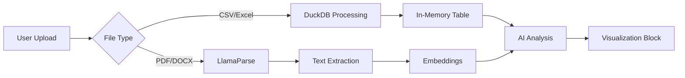

# Transforming Your App into a Data Analytics & Research Suite
## Comprehensive Research Report

---

## Executive Summary

Based on extensive research, I recommend transforming your block-based app into a powerful data analytics and research suite by integrating:

1. **DuckDB** as the core data processing engine (in-browser via WASM)
2. **Pyodide/JupyterLite** for Python execution in the browser
3. **LangChain agents** with code interpreter capabilities
4. **Tavily API** for web research integration
5. **LlamaParse/Unstructured.io** for document processing
6. **Plotly.js** for interactive visualizations

This architecture leverages your existing block system while adding powerful data capabilities without complex backend infrastructure.

---

## 1. Core Data Processing Architecture

### Recommended Stack: DuckDB + Pyodide

**Why This Combination:**
- **DuckDB** runs entirely in the browser via WebAssembly
- Provides SQL-based analytics on CSV/Excel files with no server required
- Can process gigabytes of data locally with sub-second query times
- Native support for Parquet, CSV, JSON formats

**Implementation Strategy:**
```typescript
// Browser-side DuckDB initialization
import * as duckdb from '@duckdb/duckdb-wasm';

const DUCKDB_CONFIG = {
  query: {
    castBigIntToDouble: true,
  },
  path: {
    mvp: {
      mainModule: '/duckdb-mvp.wasm',
      mainWorker: '/duckdb-browser-mvp.worker.js',
    },
  },
};

// Create a new data analysis block
export class DataAnalysisBlock extends BaseBlock {
  private db: duckdb.Database;
  
  async initialize() {
    const bundle = await duckdb.selectBundle(DUCKDB_CONFIG);
    const worker = new Worker(bundle.mainWorker);
    const logger = new duckdb.ConsoleLogger();
    this.db = new duckdb.Database(logger, worker);
  }
  
  async loadCSV(file: File) {
    const conn = await this.db.connect();
    await conn.registerFileHandle(file.name, file);
    await conn.query(`CREATE TABLE data AS SELECT * FROM '${file.name}'`);
  }
}
```

### Python Execution Layer

**Pyodide Integration:**
- Run Python code directly in the browser
- Access to pandas, numpy, matplotlib, scikit-learn
- No server infrastructure needed
- ~200ms startup time with caching

```typescript
// Pyodide integration for Python blocks
export class PythonAnalysisBlock extends BaseBlock {
  private pyodide: any;
  
  async initialize() {
    this.pyodide = await loadPyodide({
      indexURL: "https://cdn.jsdelivr.net/pyodide/v0.24.1/full/"
    });
    
    // Pre-load essential packages
    await this.pyodide.loadPackage(["pandas", "numpy", "matplotlib"]);
  }
  
  async executePython(code: string, data: any) {
    // Pass data from DuckDB to Python
    this.pyodide.globals.set("df", data);
    return await this.pyodide.runPythonAsync(code);
  }
}
```

---

## 2. File Processing Pipeline

### Multi-Format Document Handling

**LlamaParse for Complex Documents:**
- Handles PDF, DOCX, PPTX, XLSX with high accuracy
- Preserves document structure and hierarchy
- Extracts tables, charts, and images
- 97.9% accuracy on complex tables (based on 2024 benchmarks)

**Implementation:**
```typescript
// Server-side document processing service
export class DocumentProcessingService {
  async processDocument(file: File) {
    if (file.type.includes('spreadsheet') || file.name.endsWith('.csv')) {
      // Use DuckDB directly for structured data
      return await this.processCsvWithDuckDB(file);
    } else if (file.type.includes('pdf') || file.type.includes('document')) {
      // Use LlamaParse for unstructured documents
      return await this.processWithLlamaParse(file);
    }
  }
  
  private async processWithLlamaParse(file: File) {
    const formData = new FormData();
    formData.append('file', file);
    
    const response = await fetch('https://api.llamaindex.ai/parse', {
      method: 'POST',
      headers: { 'Authorization': `Bearer ${LLAMAPARSE_API_KEY}` },
      body: formData
    });
    
    const result = await response.json();
    // Convert to embeddings for RAG
    return await this.generateEmbeddings(result.text);
  }
}
```

### Data Flow Architecture



---

## 3. AI-Powered Analysis Engine

### LangChain Agent Architecture

**Code Interpreter Pattern:**
```typescript
export class DataAnalysisAgent {
  private agent: any;
  
  constructor() {
    // Initialize with code execution capabilities
    this.agent = new LangChainAgent({
      tools: [
        new PythonCodeInterpreter(),
        new SQLQueryTool(),
        new VisualizationTool(),
        new WebSearchTool()
      ],
      model: 'gpt-4-turbo',
      systemPrompt: DATA_ANALYST_PROMPT
    });
  }
  
  async analyzeData(query: string, context: DataContext) {
    // Multi-step reasoning with code execution
    const plan = await this.agent.plan(query, context);
    
    for (const step of plan.steps) {
      if (step.type === 'code') {
        const result = await this.executePython(step.code);
        step.result = result;
      } else if (step.type === 'query') {
        const result = await this.executeDuckDB(step.sql);
        step.result = result;
      }
    }
    
    return plan;
  }
}
```

### Research Integration

**Tavily API for Web Research:**
```typescript
export class ResearchBlock extends BaseBlock {
  async performResearch(query: string, context: any) {
    // Use Tavily for real-time web search
    const searchResults = await tavily.search({
      query: query,
      search_depth: 'advanced',
      include_domains: ['arxiv.org', 'scholar.google.com'],
      max_results: 10
    });
    
    // Process and summarize findings
    const summary = await this.summarizeResearch(searchResults);
    
    // Create a new content block with findings
    return this.createResearchBlock(summary);
  }
}
```

---

## 4. Visualization Architecture

### Interactive Charts with Plotly.js

**Why Plotly.js:**
- Built on D3.js with high-level abstractions
- 40+ chart types including 3D and statistical plots
- Excellent interactivity (zoom, pan, hover)
- React integration via react-plotly.js

**AI-Generated Visualizations:**
```typescript
export class VisualizationBlock extends BaseBlock {
  async generateVisualization(data: any, userQuery: string) {
    // AI determines best visualization type
    const vizPlan = await this.ai.planVisualization({
      data: data,
      query: userQuery,
      availableCharts: ['scatter', 'bar', 'heatmap', '3d-surface']
    });
    
    // Generate Plotly config
    const plotlyConfig = {
      data: vizPlan.traces,
      layout: vizPlan.layout,
      config: { responsive: true }
    };
    
    return this.renderPlotly(plotlyConfig);
  }
}
```

---

## 5. Implementation Roadmap

### Phase 1: Core Infrastructure (Week 1-2)
1. **Integrate DuckDB WASM**
   - Set up WebAssembly module loading
   - Create data loading utilities
   - Implement SQL query interface

2. **Add Pyodide Support**
   - Configure Python environment
   - Set up package loading
   - Create code execution sandbox

### Phase 2: File Processing (Week 3-4)
1. **Document Upload System**
   - Multi-file drag & drop
   - Format detection
   - Progress tracking

2. **Processing Pipeline**
   - LlamaParse integration for PDFs
   - Excel/CSV direct loading
   - Chunking and embedding generation

### Phase 3: AI Analysis (Week 5-6)
1. **LangChain Agent Setup**
   - Code interpreter tools
   - SQL generation
   - Multi-step reasoning

2. **Research Integration**
   - Tavily API setup
   - Citation management
   - Research summary blocks

### Phase 4: Visualization (Week 7-8)
1. **Plotly Integration**
   - React component setup
   - AI-driven chart selection
   - Interactive features

2. **Dashboard Creation**
   - Layout templates
   - Export capabilities
   - Real-time updates

---

## 6. Technical Advantages

### Why This Architecture Works

1. **No Backend Complexity**
   - DuckDB and Pyodide run entirely in-browser
   - Reduces server costs and latency
   - Scales to unlimited users automatically

2. **Powerful Yet Simple**
   - SQL for data queries (familiar to analysts)
   - Python for complex analysis
   - Natural language interface via AI

3. **Leverages Existing Infrastructure**
   - Builds on your block system
   - Uses existing embedding pipeline
   - Integrates with current AI services

4. **Performance Benefits**
   - Local computation = no network latency
   - DuckDB processes GBs of data in seconds
   - Incremental updates via your block system

---

## 7. Competitive Differentiation

### vs Julius.ai
- **Your Advantage**: Full control over UI/UX, integrated with content creation
- **Julius Limitation**: Purely analysis-focused, no content management

### vs Traditional BI Tools
- **Your Advantage**: AI-native, conversational interface
- **BI Tool Limitation**: Requires technical expertise, rigid workflows

### vs Jupyter Notebooks
- **Your Advantage**: Non-technical user friendly, block-based organization
- **Jupyter Limitation**: Code-first, intimidating for non-programmers

---

## 8. Key Implementation Considerations

### Security & Privacy
- All data processing happens client-side by default
- Sensitive data never leaves the browser
- Optional server-side processing for large files

### Performance Optimization
```typescript
// Lazy loading strategy
const DataAnalysisModule = lazy(() => import('./DataAnalysis'));
const PyodideModule = lazy(() => import('./PyodideIntegration'));

// Only load when user creates data block
if (blockType === 'data-analysis') {
  await Promise.all([
    DataAnalysisModule.preload(),
    PyodideModule.initialize()
  ]);
}
```

### Error Handling
- Graceful degradation if WASM not supported
- Fallback to server-side processing
- Clear user feedback for processing limits

---

## 9. Sample User Workflows

### Workflow 1: Sales Analysis
1. User drags sales.csv into editor
2. Creates AI analysis block: "Show me quarterly trends"
3. System generates SQL query via DuckDB
4. Results displayed in auto-generated chart
5. User asks: "Research industry benchmarks"
6. Tavily fetches relevant data
7. Combined into comprehensive report

### Workflow 2: Research Paper
1. Upload multiple PDFs
2. LlamaParse extracts content
3. AI summarizes key findings
4. User queries: "Compare methodologies"
5. System creates comparison table
6. Export as formatted document

---

## 10. Recommended Next Steps

### Immediate Actions
1. **Prototype DuckDB Integration**
   - Test with sample CSV files
   - Measure performance benchmarks
   - Validate browser compatibility

2. **Evaluate Document Processing**
   - Compare LlamaParse vs Unstructured.io
   - Test with your typical documents
   - Assess accuracy requirements

3. **Design AI Agent Prompts**
   - Create specialized prompts for data analysis
   - Define tool selection logic
   - Test multi-step reasoning

### Technical Decisions Needed
1. **Hosting Strategy**: CDN for WASM files vs bundling
2. **Processing Limits**: Client-side file size limits
3. **Caching Strategy**: IndexedDB for processed data
4. **Export Formats**: PDF, Excel, PowerPoint support

---

## Conclusion

This architecture transforms your app into a powerful data analytics suite while maintaining simplicity. By leveraging browser-based computation (DuckDB + Pyodide) and AI-powered analysis (LangChain agents), you can offer Julius.ai-level capabilities with better integration and user experience.

The block-based architecture becomes a significant advantage, allowing users to mix data analysis with content creation seamlessly. This positions your app uniquely in the market as a comprehensive knowledge work platform.

**Estimated Development Time**: 8-10 weeks for full implementation
**Complexity**: Medium (most complexity handled by libraries)
**Scalability**: Excellent (computation happens client-side)
**User Impact**: High (transforms app capabilities fundamentally)